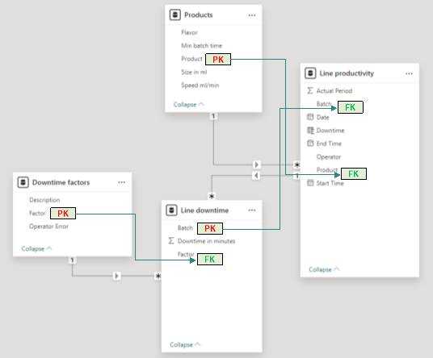

| \[14/12/2024\] |
|----------------|

Subtitle layout table

| Manufacturing Downtime Project |
|--------------------------------|

Title layout table

# Team {#team .unnumbered}

> \[Name 1\]
>
> \[Name 2\]
>
> {width="4.760416666666667in"
> height="1.5416666666666667in"}

# Data Cleaning and Preprocessing

Data Preprocessing: Clean and preprocess the data using Power BI

**Deliverables:** Cleaned dataset ready for analysis.

## **Steps** {#steps .unnumbered}

The data consists of 4 Tables of data and 1 table as a data dictionary

> - **Downtime factors Sheet**

<!-- -->

 - Loaded sheet and selected Downtime factors Sheet

 - Promoted header and changed Type

 - Confirmed by data view NO Errors and NO Empty data

<!-- -->

- **Line productivity Sheet**

<!-- -->

- Loaded sheet and selected Downtime factors Sheet

- Promoted header and changed Type

- Confirmed by data view NO Errors and NO Empty data

- KEEP ONLY Required Columns

- Calculated Actual Period in minutes to:

<!-- -->

- get this values and use it for further calculations

- No negative values confirm no errors in start and end times Entry

<!-- -->

- **Line downtime Sheet**

<!-- -->

- Loaded sheet and selected Line factors Sheet

- Promoted header but found extra undesired row.

- removed 1 top row first and Promoted header

- Confirmed by data view NO Errors and NO Empty data in Batch but all
  other data have empty values

- Empty values are due to each factor data is displayed in separate
  column

- Unpivot 12 factors in two column factor and Downtime in minutes

- Confirmed by data view NO Errors and NO Empty data in all remaining
  columns

<!-- -->

- **Products Sheet**

<!-- -->

- Loaded sheet and selected Products Sheet

- Promoted header and changed Type

- Confirmed by data view NO Errors and NO Empty data

- To use Size in calculations, it is better to use it in single unit.
  SO, we will change all into ml and keep necessary columns only

<!-- -->

- {width="5.58125in"
  height="4.615972222222222in"}**ERD (Entity Relationship Diagram)**

# Analysis Questions Phase

Determine Data Analysis Questions: Determine all possible analysis
questions that can be deducted from the given dataset and would be of
interest to the organization's decision makers.

**Deliverables:** Set of analysis questions that can be answered via the
dataset.

## **Steps** {#steps-1 .unnumbered}

- **All Available Data**

<!-- -->

- Downtime \[Factor -- Operator Error (YES/NO)\]

- Time \[ Date -- Start -- End -- Actual Period \]

- Unique \[ Batch -- Product -- Operator - Flavor\]

<!-- -->

- **To check Downtime (Sum, Average, Max, Min, Mode)** **vs:**

<!-- -->

- Factor

- Operator Error (YES/NO)

- Operator (Name)

- Batch

- Product

- Flavor

<!-- -->

- 

# Dashboard Phase

Build Dashboard: Build a Power BI dashboard that visualize the answers
to the asked questions.

**Deliverables:** Power BI dashboard.

## **Steps** {#steps-2 .unnumbered}

- Every one to record every step he makes

- 

# Final Presentation

Prepare a report and presentation summarizing the project work,
including data analysis, model development, and deployment.

**Deliverables:** Final report and presentation.

## **Steps** {#steps-3 .unnumbered}

- Every one to record every step he makes

- 

# Discussion {#discussion .unnumbered}

\[Summarize the discussion for each issue, state the outcome, and assign
any action items.\]

# Summary {#summary .unnumbered}

\[Summarize the status of each area/department.\]
